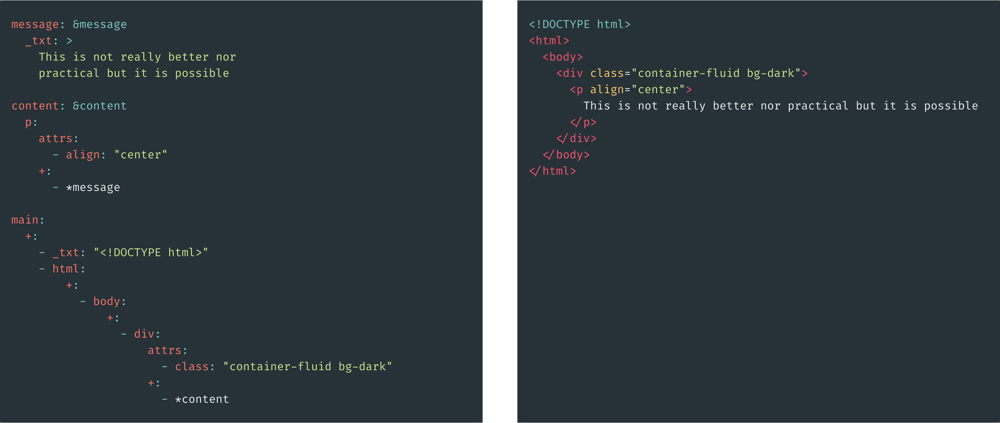

# y2h

YAML to HTML transcompiler



## [Usage](./docs/README.md)
```
NAME:

	y2h - YAML to HTML transcompiler

SYNOPSIS

	./y2h.sh <datafile.yaml>

	y2h allows you to write HTML without writing in HTML.
	<datafile.yaml> must be in the correct format
```